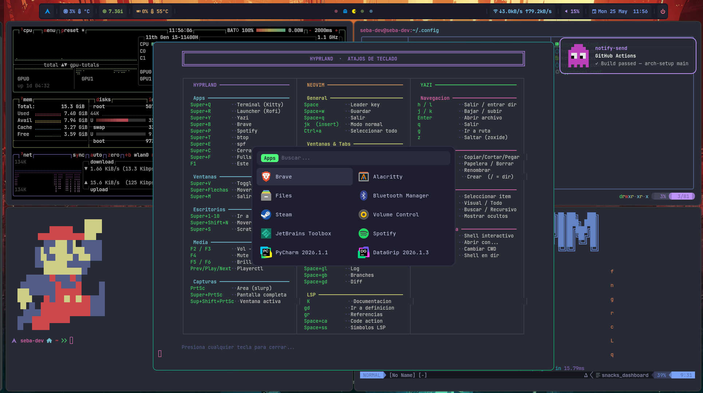

# arch-setup

Instalador y dotfiles personalizados para **Arch Linux + Hyprland**.

```
arch-setup/
├── dotfiles/      # Configs: Hyprland, Waybar, Kitty, Neovim, Dunst, Rofi…
└── arch-install/  # Script de instalación interactivo con soporte dual boot
```

---

## dotfiles

Tema visual basado en **Dracula** para un entorno Wayland completo.

| App | Descripción |
|-----|-------------|
| Hyprland | Compositor Wayland con keybinds y animaciones |
| Waybar | Barra con módulos de audio, red, batería y workspaces |
| Kitty | Terminal con JetBrainsMono Nerd Font |
| Dunst | Notificaciones con iconos pixel art aleatorios |
| Rofi | Launcher y selector de salida de audio |
| Neovim | Editor con configuración personalizada |
| Yazi | File manager en terminal |
| Starship | Prompt minimalista |
| Zsh | Autosuggestions, syntax highlighting y búsqueda en historial |
| Tmux | Multiplexer con TPM |

### Instalación rápida

```bash
git clone https://github.com/avilasebastianm/arch-setup.git
cd arch-setup/dotfiles
bash install.sh
```

El instalador muestra un menú para elegir qué instalar (o `a` para todo):

| Opción | Qué hace |
|--------|----------|
| `1` Configs | Copia todo a `~/.config`, los scripts de `bin/` a `~/.local/bin` y crea `~/Pictures/Screenshots` |
| `2` Paquetes | Instala Hyprland + esenciales y después `packages/pkglist.txt` |
| `3` Paquetes AUR | Instala `yay` si falta y después `packages/pkglist-aur.txt` |
| `4` Fuentes | Copia las fuentes a `~/.local/share/fonts` |
| `5` .zshrc | Copia `home/.zshrc` a tu home |

> ⚠️ La opción **Configs** reemplaza las carpetas existentes en `~/.config` (hypr, waybar, kitty, etc.). Hacé backup si tenés algo propio.

### Qué trae

**Waybar**
- CPU (uso + temperatura) y GPU (uso + temperatura). Detectan el sensor solos: Intel/AMD para CPU, NVIDIA/AMD para GPU. Si no hay GPU dedicada, el módulo se oculta.
- **Netpulse**: un paquete que viaja por la barra haciendo ping a `1.1.1.1`. Va más lento con más latencia y se rompe en rojo si se pierde. La ventana de resets se ajusta con `NETPULSE_WINDOW`. Se puede probar sin tocar la red con `netpulse-test.sh`.
- **Selector de WiFi**: click en el módulo de red abre un Rofi con las redes cercanas ordenadas por señal. Si la red es nueva pide la contraseña (campo enmascarado).
- Batería (se detecta sola, en PCs de escritorio no aparece), audio, reloj, notificaciones, bandeja y botón de apagado.

**Hyprland**
- Wallpapers aleatorios de [Wallhaven](https://wallhaven.cc) cada 15 minutos (`hypr/hyprhaven.conf`, ahí se eligen los temas). Sin internet usa una imagen de `~/.local/share/wallpapers/`.
- Splash con una cita de Borges al iniciar sesión.
- Cheatsheet de atajos con `F1`.

**Dunst**: notificaciones con iconos pixel art aleatorios.

### Atajos principales

`Super` es la tecla Windows. `F1` muestra la lista completa.

| Atajo | Acción |
|-------|--------|
| `Super+Q` | Terminal (Kitty) |
| `Super+R` | Launcher (Rofi) |
| `Super+E` / `Super+Y` | File manager / Yazi |
| `Super+C` | Cerrar ventana |
| `Super+V` | Ventana flotante |
| `Super+F` | Pantalla completa |
| `Super+B` | Navegador (Brave) |
| `Super+P` | Spotify (flatpak) |
| `Super+T` | btop |
| `Super+M` | Salir de Hyprland |
| `Print` | Captura de un área |
| `Super+Print` | Captura de pantalla completa |
| `Super+Shift+Print` | Captura de la ventana activa |
| `Super+Shift+I` | Prender/apagar el iPad como monitor |
| `Super+Shift+Ctrl+I` | Menú de resolución del iPad |
| `Super+Shift+=` / `Super+Shift+-` | Subir/bajar la resolución del iPad |

### Adaptarlo a tu máquina

Casi todo se detecta solo, pero hay dos cosas que vale la pena revisar:

- **Monitores** (`~/.config/hypr/hyprland.conf`): vienen configuradas dos pantallas (`eDP-1` a 144 Hz y `HDMI-A-1`) y una regla genérica `monitor=,preferred,auto,1` para cualquier otra. Si tus pantallas tienen otros nombres, la regla genérica las toma igual. Para ajustarlas, mirá los nombres con `hyprctl monitors` y editá esas líneas y las de `workspace = N, monitor:...`.
- **Workspaces en Waybar** (`~/.config/waybar/config.jsonc`): lo mismo, los nombres de monitor de `persistent-workspaces`.
- **Apps de los atajos**: navegador, Spotify, etc. están en `hyprland.conf`. Cambialos por los que uses.

### iPad como monitor extra (opcional)

Podés usar un iPad como segunda pantalla de Hyprland por VNC ([wayvnc](https://github.com/any1/wayvnc)).
El `install.sh` deja los scripts en `~/.local/bin` y `wayvnc` se instala con los paquetes.

1. **Configurá tu usuario y contraseña** (una sola vez). El repo no trae credenciales: el script las pide y genera las claves de tu máquina en `~/.config/wayvnc/`.

   ```bash
   ipad-display-setup.sh
   ```

2. **Activá o desactivá el display** con `Super+Shift+I` o haciendo click en el ícono del iPad en Waybar.
3. **Conectate desde el iPad** con una app VNC (Jump Desktop, bVNC, etc.) a la IP y puerto que muestra la notificación, con el usuario y contraseña del paso 1.

Notas:

- El iPad y la PC tienen que estar en la misma red.
- La resolución por defecto es `2430x1822@60`. Para tu modelo, exportá `IPAD_RES` (por ejemplo `IPAD_RES=2388x1668@60`) o cambiá el valor en `~/.local/bin/ipad-display-on.sh`.
- **Seguridad:** wayvnc queda escuchando en todas las interfaces (`0.0.0.0`) del puerto elegido (5900 por defecto), con usuario, contraseña y TLS obligatorios. Usá una contraseña fuerte y no lo expongas a internet ni lo dejes abierto en redes públicas. Si no lo usás, dejá el display apagado.
- Nunca subas `~/.config/wayvnc/` a un repo: tiene tu contraseña y tus claves privadas.

---

## arch-install

Instalador interactivo de Arch Linux con:

- Selección de disco y particionado automático
- Soporte **dual boot** con Windows (redimensiona partición NTFS automáticamente)
- Opciones: swap, home separado, entorno gráfico
- Detección automática de GPU (NVIDIA, AMD, Intel o híbrida) para instalar los drivers correctos
- NetworkManager + iwd para WiFi y PipeWire para audio, ya habilitados
- GRUB con detección de otros sistemas operativos

### Uso desde live ISO

```bash
# Conectarse a internet primero:
# WiFi:     iwctl station wlan0 connect "SSID"
# Ethernet: dhcpcd

curl -L https://raw.githubusercontent.com/avilasebastianm/arch-setup/main/arch-install/install.sh | bash
```

---

## Requisitos

- Arch Linux (live ISO o instalación base)
- Conexión a internet
- UEFI / GPT

## Capturas

> Escritorio con los dotfiles instalados — Hyprland · Waybar · Kitty · Rofi



---

*Hecho en Buenos Aires 🇦🇷*
